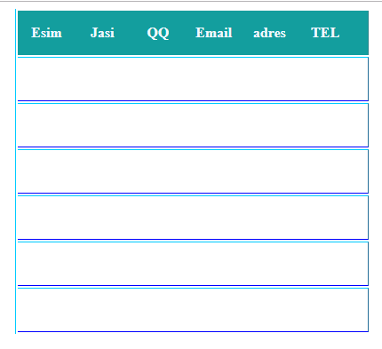

# ekynshy tapsrma
>
## sýret

>
## barysy
---
### HTML  CSS  tuıyn sozden paıdalanyp keste jasaý
>
##  tusynykteme
> **jalpy tusynykteme* Sonymen, HTML degen ne? HTML tegi neni bildiredi.***Men bul maqalamda HTML degennin' ne ekendigine toqtalyp qana qoi'mai', HTML din' u'i'reny'ge qans'alyqty jen'il til ekendigine oqyrmandardyn' ko'zderin jetkizgim keledi.Sebebi, bul tildi u'i'reny' arqyly siz  qalai' sai't jasalatynyn  sa'l de bolsa ug'yna alasyz.

HTML degenimiz-  ag'yls'yns'a HyperTextMarkupLanguage, i'ag'ni' gi'perteksti tan'balay' tili degendi bildiredi.Osy til arqyly sai'ttyn' paraqtary jazylady.

